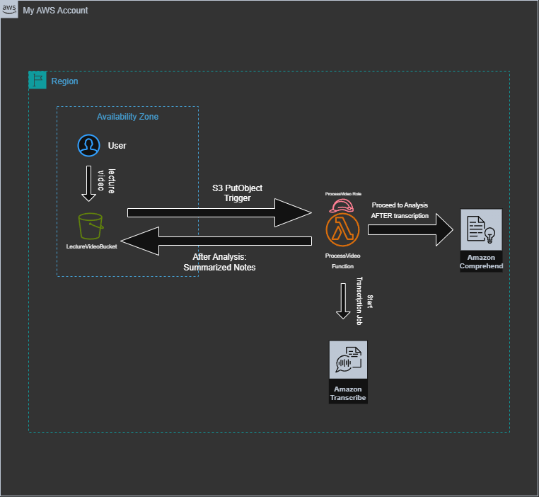

# Lecture Notes Automation

This project automates the conversion of recorded lecture videos into summarized notes using AWS services. It leverages a serverless, event-driven architecture to transcribe lectures and extract key information using NLP tools — all within the AWS Free Tier.

---

## ⭐️ Situation

As a student, I often found it time consuming and inefficient to manually review and summarize recorded lectures that I had already attended/watched. I wanted to create a system that could automate this task, delivering concise summaries of the lectures, so I could go over the main concepts of the lecture without having to search through the entire recording. 

---

## 🎯 Task

The goal was to design and implement a serverless pipeline using AWS that:
- Automatically responds to lecture uploads
- Transcribes the lecture content
- Applies NLP to extract key phrases and entities
- Stores summarized notes for quick access

All while adhering to AWS Free Tier limits and practicing least-privilege IAM principles.

---

## 🛠️ Action

I built the system with the following architecture:

- **Trigger**: S3 `PutObject` event when a lecture video is uploaded
- **Compute**: AWS Lambda (Python 3.12)
- **Services Used**:
  - **Amazon S3** – for upload detection and note storage
  - **Amazon Transcribe** – converts audio to text
  - **Amazon Comprehend** – extracts entities and key phrases
  - **IAM** – enforces least-privilege access control

   

### Implementation:

1. **S3 Bucket Setup**
   - Configured to trigger Lambda on `uploads/` prefix
   - Summarized notes stored in `summarized-notes/`

2. **Lambda Function**
   - Starts the transcription job using Transcribe
   - Waits for completion and retrieves the transcript
   - Analyzes content with Comprehend
   - Formats and saves a summary text file back to S3

3. **IAM Role Configuration**
   - Custom IAM role with specific permissions for:
     - `s3:GetObject`, `s3:PutObject`
     - `transcribe:StartTranscriptionJob`, `transcribe:GetTranscriptionJob`
     - `comprehend:DetectKeyPhrases`, `comprehend:DetectEntities`

---

## ✅ Result

The system successfully automates the creation of lecture notes with no manual intervention. Lecture files uploaded to S3 are processed within minutes, and concise summaries are delivered in a seperate folder within the same bucket. This project improved my understanding of:

- AWS Lambda orchestration
- IAM policy design (least privilege)
- Integrating multiple AWS AI services in a single workflow

It also made lecture review faster and more effective for both me and peers I shared it with.

---

## 🧱 Challenges Faced

- **IAM Complexity**: Fine-tuning least-privilege roles required multiple iterations and debugging across services.
- **Architecture Simplification**: I originally used two Lambda functions but refactored to a single one for efficiency and lower latency.
- **CloudWatch Logging**: Lack of clear success indicators required enhanced logging and manual result validation in S3.

---

## ⚠️ Limitations

To stay within the AWS Free Tier, I used Amazon Comprehend for summarization. While it highlights useful content, it focuses more on sentiment analysis rather than providing detailed notes for the class. 

If budget weren’t a concern, I would integrate **Amazon Bedrock** with a language model like **Claude** or **ChatGPT** to produce more efficient notes. The Lambda function would pass transcript text to the LLM and save its response as the final summary.
